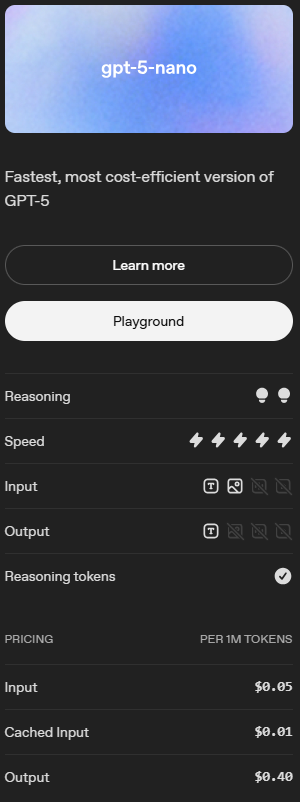

# Introducción

En este documento recopilamos los pasos iniciales para crear y configurar un agente de IA usando Python y la API de OpenAI. Se cubren conceptos básicos como *conocimiento*, *razonamiento*, roles de los mensajes y la creación de un chatbot simple con memoria de conversación, permitiendo experimentar con modelos de lenguaje de forma práctica y progresiva.

---

## Índice

1. [Creación básica](#1-creamos-un-archivo-mainpy)
2. [Agente de IA](#2-vamos-a-crear-un-agente-de-ia)
3. [Chatbot con memoria](#3-vamos-a-crear-un-chatbot)
4. [Herramientas](#4-implementación-de-herramientas)
5. [Optimizaciones](#5-modificaciones-para-optimización)
6. [Lectura y edición](#6-lectura-de-archivos-y-modificación)
7. [Código completo](#7-archivos-completos)

---

## 1. Creamos un archivo `main.py`

- Hacemos que imprima un simple `Mi primer agente de IA`

---

## 2. Vamos a crear un agente de IA

- Dos conceptos claves: *conocimiento* y *razonamiento* (podemos obtenerlos a través de *modelos de lenguaje*)
- *Modelos de lenguaje*: existen varios, algunos especializados en conocimiento, otros en razonamiento, etc.
- *Razonamiento*: capacidad del agente para dividir una tarea en pequeñas tareas o procesos

### 2.1. Creamos un entorno virtual en el que instalar todas las dependencias (para Windows estos son los comandos)

```
python -m venv env  
.\env\Scripts\Activate.ps1
```

### 2.2. Instalamos las dependencias necesarias

```
pip install openai  
pip install python-dotenv
```

- *python-dotenv*: permite poner el token de openai en un archivo de configuración para que no esté directo en el código

### 2.3. Obtenemos **API Key** desde https://platform.openai.com/

### 2.4. Creamos un nuevo archivo llamado `.env`  
Dentro añadimos el siguiente texto:  

```
OPENAI_API_KEY=XXXX
```

(si lo llamamos de esta manera será leído en automático)

### 2.5. Cargamos las dependencias anteriores en nuestro código

```python
from openai import OpenAI
from dotenv import load_dotenv

load_dotenv()
```

Con `load_dotenv()` es como cargamos nuestra API Key, ya que lee directamente desde nuestro archivo `.env`


### 2.6. Creamos el cliente de Open AI 

Para poder interactuar con los modelos de lenguaje escribimos el siguiente código:

```python
client = OpenAI()
```

Existen varias formas o "APIS" para utilizarse, el más reciente a fecha de 25 de noviembre de 2025 es el llamado **Response**. Para utilizarlo usamos el siguiente código:

```python
response = client.responses.create(
	model = "gpt-5-nano",
	input = "Dime el nombre de 3 lenguajes de programación (solo el nombre, nada más)"
)
```

De esta forma generamos el modelo a utilizar, y una entrada. Existen multitud de modelos, algunos especializados en código, pero para esta prueba usaremos uno bastante económico




### 2.7. Imprimimos la respuesta

```python
print(response.output_text)
```

### 2.8. Código completo

```python
from openai import OpenAI
from dotenv import load_dotenv

load_dotenv()

print("Mi primer agente de IA")

client = OpenAI()

response = client.responses.create(
    model = "gpt-5-nano",
    input = "Dime el nombre de 3 lenguajes de programación (solo el nombre, nada más)"
)

print(response.output_text)
```

---

## 3. Vamos a crear un chatbot

- Un *chatbot* nos permite tener un agente con el que tener una conversación, poder preguntarle cosas y obtener respuestas

### 3.1. Creamos un bucle infinito

```python
while True:
	
	user_input = input("Tú: ").strip()
	
	response = client.responses.create(
	    model = "gpt-5-nano",
	    input = user_input
	)
	
	print(f"Asistente: {response.output_text}")
```

- Añadimos un bucle infinito para poder mantener activa la interacción con el agente
- Añadimos la entrada del usuario
- Damos formato a la salida/respuesta del agente

### 3.2. Creamos una memoria simple

- Hasta ahora, nuestro agente es incapaz de recordar información ya aportada. Si le dijéramos nuestro nombre, y en un siguiente prompt le preguntamos cómo me llamo, te dirá que no lo sabe si no se lo dices. Esto es porque carece de memoria. Para corregir esto vamos a crear el siguiente código que nos permite de forma muy simple (aunque costosa en cuanto a tokens) almacenar la información que se vaya generando durante la conversación para que el agente la pueda tener presente en cada respuesta que vaya a dar. Para un uso exhaustivo del agente esto no es nada óptimo. Pero, para ejemplificar, es bastante útil nuestro contexto de aprendizaje

```python
messages = [
	{"role": "system", "content": "Eres un asistente útil, preciso, que habla español y eres muy conciso con tus respuestas"}
]
```

- Añadimos una variable llamada `messages`, la cual almacenará nuestro historial. Cada mensaje debe tener dos propiedades: `role` y `content`

En el contexto de un agente de IA, un **rol** es la identidad o posición desde la que se emite un mensaje, lo que determina **cómo debe interpretarlo el modelo** y qué función cumple dentro de la conversación o del flujo de trabajo

| Rol           | Descripción breve                                                                  |
| ------------- | ---------------------------------------------------------------------------------- |
| **system**    | Define el comportamiento general, reglas y límites del agente de IA.               |
| **developer** | Ajusta o refina instrucciones internas para controlar cómo procesa la IA.          |
| **user**      | Representa las peticiones, preguntas o instrucciones provenientes del usuario.     |
| **assistant** | Es la respuesta generada por la IA según las instrucciones y el contexto.          |
| **tool**      | Permite a la IA invocar funciones externas o herramientas para tareas específicas. |

En un agente de IA, **content** es el **mensaje o información específica** que acompaña a un rol, indicando **qué se dice** dentro de esa comunicación

### 3.3. Creamos algunas validaciones

Para evitar errores, vamos a programar la salida del asistente y que en caso de no haber escrito nada que siga activo

```python
# Validaciones
if not user_input:
	continue

if user_input.lower() in ("exit", "bye", "fin"):
	print("\n¡Hasta luego!\n")
	break
```

### 3.4. Añadimos historial de mensajes

```python
# Agregar nuestro mensaje al historial
messages.append({"role": "user", "content": user_input})
```

- Añadimos cada mensaje que enviemos a la variable que almacena el histórico de mensajes, para que el agente pueda tenerlo siempre presente y así "recordar" información ya proporcionada. Para esto usamos el `rol: user`, como `content` usaremos la entrada del usuario con `user_input`

- Hacemos que el input de entrada pase a ser el arreglo o array de mensajes que almacenamos en la variable `messages`, de este modo, el asistente obtendrá todos los mensajes en cada interacción, permitiéndole "recordar" o tener memoria

```python
response = client.responses.create(
	model = "gpt-5-nano",
	input = messages
)
```

- Añadimos la respuesta del agente a una variable, y la agregamos al histórico de mensajes para que también recuerda la información que ya nos ha proporcionado el agente. Así podrá dar respuestas del tipo, 'como ya te dije anteriormente...'. Para ello usamos el rol de `assistant` y como contenido, le pasamos como `content` las respuestas almacenadas

```python
assistant_reply = response.output_text
messages.append({"role": "assistant", "content": assistant_reply})
```

### 3.5. Generamos la respuesta

```python
print(f"Agente: {assistant_reply}")
```

### 3.6. Código completo

```python
from openai import OpenAI
from dotenv import load_dotenv

load_dotenv()

print("Mi primer agente de IA")

client = OpenAI()

messages = [

    {"role": "system", "content": "Eres un asistente útil, preciso, que habla español y eres muy conciso con tus respuestas"}

]

while True:

    user_input = input("Tú: ").strip()

    # Validaciones
    if not user_input:
        continue

    if user_input.lower() in ("exit", "bye", "fin"):
        print("\n¡Hasta luego!\n")
        break

    # Agregar nuestro mensaje al historial
    messages.append({"role": "user", "content": user_input})

    response = client.responses.create(
        model = "gpt-5-nano",
        input = messages
    )

    assistant_reply = response.output_text
    messages.append({"role": "assistant", "content": assistant_reply})

    print(f"Agente: {assistant_reply}")
```

---

## 4. Implementación de herramientas

- Para que un agente de IA, sea realmente útil. Es importante que le dotemos de la capacidad de poder realizar acciones concretas. Piense en ello como la capacidad del asistente, de por ejemplo, crear un archivo en nuestro directorio actual de trabajo. Si el agente no tiene implementada la herramienta necesaria para poder hacer esta acción, no lo hará

- Para esto, debemos elegir un modelo de lenguaje (LLMs) con soporte para herramientas. OpenAI en la actualidad llama a esto *Function calling*, otros modelos siguen refiriéndose a esto como *tools*. Esta diferencia es porque OpenAI separa los conceptos de *funciones* y *herramientas*. Sin embargo, para nuestro propósito aquí, esto es indiferente

- Un modelo con soporte para herramientas, podemos a través de una configuración indicarle la existencia de una función. De nuevo piense en ello como si un agente para una tarea dada dijera, "ah, ok, como tengo que hacer un resumen de este documento y añadirlo a un archivo que tengo que crear, voy a usar esta función que me lo permite"

- Para programar algo como la creación de un archivo, desde luego en python tendríamos formas de hacerlo. Pero para el agente tenemos que hacer una representación de la función que haríamos en python pero que el modelo entienda. Esto se hace siguiendo la estructura de programación que vamos a ver a continuación

```python
"type": "function",
"name": "create_files_in_dir",
"description": "Crear archivos en formato Markdown (.md) en el directorio actual o uno dado",
"parameters": {
	"type": "object",
	"properties": {
		"directory": {
			"type": "string",
			"description": "Directorio en el que se crearán los archivos" 
		},
		"filename": {
			"type": "array",
			"items": {"type": "string"},
			"description": "Lista de nombres de archivos .md a crear"
		},
		"content": {
			"type": "string",
			"description": "Contenido en formato Markdown que tendrán los archivos"
		}
	},
	"required": ["directory", "filename"]
}
```

- Especificamos que es una función `"type": "function"`, su nombre `"name": "..."` y una descripción `"description": "..."`. Las descripciones son muy importantes, ya que será la forma que tendrá el agente de poder saber cuando acudir a una función u otra

- La sección `parameters` describe qué datos necesita la función para poder ejecutarse. Como la función necesita saber en qué ubicación crear los archivos, la propiedad debe de tener un nombre descriptivo. Por ejemplo `directory` pero podría ser `path` o `target_dir`. Además, tenemos los parámetros `filename` (indica qué crear) y `content` (qué contenido escribir)

- Para cada parámetro, además de la descripción, indicamos el tipo, aquí tenemos `string` para los tipo texto de `directory` y `content`, pero también tenemos un tipo `array` para el parámetro `filename`. 

**Nota:** para más información sobre los tipos ver [Tipos de parámetros en herramientas](./Tipos de parámetros en herramientas.md)

- Por último, indicamos los parámetros imprescindibles `required` en este caso son tanto el directorio donde actuar como el nombre de archivo a crear


### 4.1. Definición de herramientas

- Entendida la teoría, pasemos a la práctica. Para ello debemos definir una función en nuestro código que nos permita llamar a la herramienta cuando sea necesario. El código quedaría de la siguiente manera:

```python
# Función de herramienta
def create_files(directory=".", filename=None, content=""):
	print("\n[+] Herramienta iniciada: create_files\n")
	try:
		if isinstance(filename, str):
			filename = [filename]
		
		os.makedirs(directory, exist_ok=True)
		
		created_files = []
		
		for name in filename:
			file_path = os.path.join(directory, name)
			
			with open(file_path, "w", encoding="utf-8") as f:
				f.write(content)
				
			created_files.append(file_path)
			
		print("\n[+] Archivo creado correctamente:\n")
		for f in created_files:
			print("   -", f)
			
		return {
			"status": "success",
			"files": created_files
		}	
			
	except Exception as e:
		print("\n[!] Error al crear los archivos:", e)
		return {
			"status": "error",
			"message": str(e)
		}
	
```

- Primero creamos la función que llama a la herramienta. En ella le pasamos tres argumentos. `directory` para indicar el directorio donde crear el archivo, si no se le pasa nada por defecto será el directorio actual; `filename` y `content`. De este modo crearemos uno o varios archivos en Markdown en el directorio indicado, con el contenido indicado

- Para esto vamos a necesitar importar la librería *os* `import os` que permite la ejecución de comandos

- Creamos un bloque `try-except` por si se aconteciera algún error

- Convertimos `filename` a una lista, para así poder manejar los casos en que se nos pasa un solo argumento como filename pero también cuando sean varios `if isinstance(filename, str)...`

- Creamos el directorio si no existe `os.makedirs(directory, exist_ok=True...`. Cuando usamos `exist_ok=True` lo que indicamos es que en caso de existir ya el directorio, que no arroje ningún error y continue

- Indicamos la ruta final del archivo  `file_path = os.path.join(directory, name)`

- Creamos el archivo y escribimos su contenido `with open(file_path, "w"...`

- Damos un formato de salida elegante con identación y guiones `print("   -", f)`

- Por último damos formato de salida a posibles errores 

**Nota:** es importante saber que aquí seguimos la estructura propia de OpenAI, si fuéramos a programar otro modelo de lenguaje debemos de revisar su documentación para usar la estructura pertinente
### 4.2. Implementaciones en el código

```python
from openai import OpenAI
from dotenv import load_dotenv
import os
import json

load_dotenv()

print("Mi primer agente de IA")

client = OpenAI()

messages = [

    {"role": "system", "content": "Eres un asistente útil, preciso, que habla español y eres muy conciso con tus respuestas"}

]

# Función de herramienta
def create_files(directory=".", filename=None, content=""):
	print("\n[+] Herramienta iniciada: create_files\n")
	try:
		if isinstance(filename, str):
			filename = [filename]
		
		os.makedirs(directory, exist_ok=True)
		
		created_files = []
		
		for name in filename:
			file_path = os.path.join(directory, name)
			
			with open(file_path, "w", encoding="utf-8") as f:
				f.write(content)
				
			created_files.append(file_path)
			
		print("\n[+] Archivo creado correctamente:\n")
		for f in created_files:
			print("   -", f)
			
		return {
			"status": "success",
			"files": created_files
		}	
			
	except Exception as e:
		print("\n[!] Error al crear los archivos:", e)
		return {
			"status": "error",
			"message": str(e)
		}

tools = [
	{
		"type": "function",
		"name": "create_files_in_dir",
		"description": "Crear archivos en formato Markdown (.md) en el directorio actual o uno dado",
		"parameters": {
			"type": "object",
			"properties": {
				"directory": {
					"type": "string",
					"description": "Directorio en el que se crearán los archivos" 
				},
				"filename": {
					"type": "array",
					"items": {"type": "string"},
					"description": "Lista de nombres de archivos .md a crear"
				},
				"content": {
					"type": "string",
					"description": "Contenido en formato Markdown que tendrán los archivos"
				}
			},
			"required": ["directory", "filename"]
		}
	}
]
while True:

    user_input = input("Tú: ").strip()

    # Validaciones
    if not user_input:
        continue

    if user_input.lower() in ("exit", "bye", "fin"):
        print("\n¡Hasta luego!\n")
        break

    # Agregar nuestro mensaje al historial
    messages.append({"role": "user", "content": user_input})

    response = client.responses.create(
        model = "gpt-5-nano",
        input = messages,
        tools=tools
    )

# Almacenar para historial
messages += response.output

for output in response.output:
	if output.type == "function_call":
		fn_name = output.name
		args = json.loads(output.arguments)
		print(f"\n[+] El modelo usa la herramienta {fn_name}\n")
		
	elif output.type == "message":
		reply = "\n".join(part.text for part in output.content)
		print(f"Asistente: {reply}")

```

- Nótese que le hemos pasado al modelo las herramientas que tiene disponibles con `tools=tools`

- Además, hemos modificado las últimas líneas, respecto del código anterior, ya que el siguiente bloque ya no nos sirve, pues las respuestas del agente no van a ser siempre solo de texto, sino que también puede hacer llamadas de funciones :

```python
# Este bloque solo da respuestas de texto, no efectua la salida de la herramienta
    assistant_reply = response.output_text
    messages.append({"role": "assistant", "content": assistant_reply})

    print(f"Agente: {assistant_reply}")
```

### 4.3. Almacenamiento de historial y manejo de salidas

En esta sección adaptamos el flujo del chatbot para **soportar herramientas**. A diferencia del código anterior, el modelo ya no genera únicamente texto: puede **invocar funciones** y devolver mensajes de forma diferenciada

El bloque relevante es:

```python
# Almacenar para historial
messages += response.output

for output in response.output:
	if output.type == "function_call":
		fn_name = output.name
		args = json.loads(output.arguments)
		print(f"\n[+] El modelo usa la herramienta {fn_name}\n")
		
	elif output.type == "message":
		reply = "\n".join(part.text for part in output.content)
		print(f"Asistente: {reply}")
```


- **Almacenamos la salida en el historial**

```python
messages += response.output
```

- `response.output` es **una lista de elementos** que puede contener tanto mensajes de texto (`message`) como llamadas a funciones (`function_call`)

- Sumamos estos elementos al historial `messages` para que el agente **recuerde todo lo que ha sucedido** en la conversación, incluyendo las acciones que ha decidido ejecutar

-  **Recorremos cada elemento de la salida**

```python
for output in response.output:
```

- Esto nos permite manejar **cada tipo de contenido por separado**, ya que no todos son respuestas de texto simples

-  **Detección de llamadas a funciones**

```python
if output.type == "function_call":
	fn_name = output.name
	args = json.loads(output.arguments)
	print(f"\n[+] El modelo usa la herramienta {fn_name}\n")
```

- Si el modelo decide usar una herramienta, `output.type` será `"function_call"`

- `fn_name` nos indica **qué función quiere invocar**

- `args` contiene los **argumentos que el modelo quiere pasar** a la función, normalmente en formato JSON, por eso los cargamos con `json.loads()`. Para ello importamos la librería json `import json`

- La línea `print(...)` nos sirve para **ver en consola qué herramienta está usando**, lo que ayuda a depurar y a entender el flujo


-  **Manejo de mensajes de texto**

```python
elif output.type == "message":
	reply = "\n".join(part.text for part in output.content)
	print(f"Asistente: {reply}")
```

- Si el elemento es un mensaje normal (`"message"`), concatenamos todas las partes de texto (`part.text`) que pueda contener `output.content`

- Luego imprimimos la respuesta formateada para el usuario, exactamente igual que antes, pero ahora dentro de un flujo que **también soporta herramientas**

**Concepto clave:**

- El historial `messages` siempre incluye **todo**, tanto texto como acciones

- El agente puede decidir **qué herramienta usar** según la conversación

- Las respuestas se manejan de forma **dinámica**, separando mensajes de texto de llamadas a funciones, lo que hace que el agente sea mucho más **versátil y realista**

Nota sobre roles (Responses): aunque en la tabla general se menciona el rol "tool" para conceptos de agentes, el API **Responses** de OpenAI solo admite los roles `assistant`, `system`, `developer` y `user` en el historial. Por eso, cuando registramos el resultado de una herramienta en el historial, lo hacemos como `assistant`.


### 4.4 Archivo `agent.py`

- Como necesitamos implementar las funciones importantes del agente. Vamos a crear un archivo llamado `agent.py`. De este modo mantenemos nuestro código ordenado y legible

```python
import os
import json

class Agent:
	def __init__(self):
		self.setup_tools()
		self.messages = [

		    {"role": "system", "content": "Eres un asistente útil, preciso, que habla español y eres muy conciso con tus respuestas"}
		
		]
		
	def setup_tools(self):
		self.tools = [
			{
				"type": "function",
				"name": "create_files_in_dir",
				"description": "Crear archivos en formato Markdown (.md) en el directorio actual o uno dado",
				"parameters": {
					"type": "object",
					"properties": {
						"directory": {
							"type": "string",
							"description": "Directorio en el que se crearán los archivos" 
						},
						"filename": {
							"type": "array",
							"items": {"type": "string"},
							"description": "Lista de nombres de archivos .md a crear"
						},
						"content": {
							"type": "string",
							"description": "Contenido en formato Markdown que tendrán los archivos"
						}
					},
					"required": ["directory", "filename"]
				}
			}
		]

	# Función de herramienta
	def create_files(self, directory=".", filename=None, content=""):
		print("\n[+] Herramienta iniciada: create_files\n")
		try:
			if isinstance(filename, str):
				filename = [filename]
			
			os.makedirs(directory, exist_ok=True)
			
			created_files = []
			
			for name in filename:
				file_path = os.path.join(directory, name)
				
				with open(file_path, "w", encoding="utf-8") as f:
					f.write(content)
					
				created_files.append(file_path)
				
			print("\n[+] Archivo creado correctamente:\n")
			for f in created_files:
				print("   -", f)
				
			return {
				"status": "success",
				"files": created_files
			}	
				
		except Exception as e:
			print("\n[!] Error al crear los archivos:", e)
			return {
				"status": "error",
				"message": str(e)
			}

	def process_response(self, response):
		# Almacenar para historial
		self.messages += response.output
		
		for output in response.output:
			if output.type == "function_call":
				fn_name = output.name
				args = json.loads(output.arguments)
				print(f"\n[+] El modelo usa la herramienta {fn_name}\n")
				
			elif output.type == "message":
				reply = "\n".join(part.text for part in output.content)
				print(f"Asistente: {reply}")
		
		return False
```

- Declaramos la clase `Agent` que usaremos para interactuar con el agente. Y una función para su inicialización `def __init__(self):`

- Declaramos una segunda función `def setup_ tools(self):` donde agregaremos las herramientas que queremos darle al modelo. Aquí agregamos el bloque de código que previamente configuramos para las herramientas. Simplemente cortamos desde el archivo `main.py` y lo identamos correctamente en la función `setup_tools`

- Del mismo modo, trasladamos la función `create_files` a este archivo (además, importamos `os`)

- En la función `init`, llamamos a la función de configuración `setup_tools()` y nos traemos también de `main.py` el historial de mensajes

- En la función `create_files` solo asegurarnos que usamos para cada argumento `self`

- Por último, creamos una función encargada de procesar las respuestas del modelo `def process_response(self, response):`. Esta función devolverá True en caso de llamar a la herramienta, y False en caso de usarla. Aquí añadimos de `main.py` el apartado para almacenar el historial y hacemos los ajusten necesarios para la programación orientada a objetos e importamos `json`. Al final, de momento, solo retornamos False

- En `main.py` importamos el archivo `Agent` con `from agent import Agent` y lo inicializamos `agent = Agent()` y añadimos al historial al agente `agent.messages.append...`, `input = agent.messages` y `tools = agent.tools`

- Y, por último, pero en main.py, llamamos al procesamiento del agente `agent.process_response(response)`
### 4.5 Código completo de `main.py` hasta ahora

```python
from openai import OpenAI
from dotenv import load_dotenv
import os
import json
from agent import Agent
load_dotenv()

print("Mi primer agente de IA")

client = OpenAI()
agent = Agent()

while True:

    user_input = input("Tú: ").strip()

    # Validaciones
    if not user_input:
        continue

    if user_input.lower() in ("exit", "bye", "fin"):
        print("\n¡Hasta luego!\n")
        break

    # Agregar nuestro mensaje al historial
    agent.messages.append({"role": "user", "content": user_input})

    response = client.responses.create(
        model = "gpt-5-nano",
        input = agent.messages,
        tools = agent.tools
    )

	agent.process_response(response)

```

### 4.6. Procesamiento de la respuesta y llamada de herramienta


```python
	def process_response(self, response):
		# Almacenar para historial
		self.messages += response.output
		
		for output in response.output:
			if output.type == "function_call":
				fn_name = output.name
				args = json.loads(output.arguments)
				print(f"\n   -[+] El modelo usa la herramienta {fn_name}\n")
				print(f"   - Argumentos: {args}")
				
				if fn_name == "create_files_in_dir":
					result = self.create_files(**args)
				
				# Agregar a la memoria la respuesta (Responses API no admite 'tool' como rol)
				self.messages.append({
					"role": "assistant",
					"content": f"[Resultado de {fn_name}]: {json.dumps(result)}"
				})
				
				return True
				
			elif output.type == "message":
				reply = "\n".join(part.text for part in output.content)
				print(f"Asistente: {reply}")
		
		return False
```

– Vamos a complementar el siguiente bloque de código para que imprima los argumentos que se están enviando a la función

- Revisamos si el nombre de la función es la que tenemos definida `if fn_name == "create_files":...`. Usamos `(**args)` de esta manera para convertir en automático los parámetros enviados por el modelo a parámetros esperados por la función. Considerando que tengan el mismo nombre

- Cuando llamamos a la herramienta debemos pasarle el resultado de la llamada al modelo para su procesamiento y pueda decidir cómo proceder. De nuevo, en el caso de OpenAI se hace de la siguiente manera, en caso de usar otro modelo revisar la documentación. `self.messages.append{...}`

### 4.7 Bucle para llamada de herramientas

- En nuestro archivo `main.py` tenemos que preparar al modelo para que pueda llamar las veces que haga falta a las herramientas. Para ello usaremos un nuevo bucle `while`. Modificamos el siguiente bloque de código:

```python
    # Agregar nuestro mensaje al historial
    agent.messages.append({"role": "user", "content": user_input})
	
	while True:
	    response = client.responses.create(
	        model = "gpt-5-nano",
	        input = agent.messages,
	        tools = agent.tools
	    )
	
		called_tool = agent.process_response(response)
		
		# Si no se llama a la herramienta, tenemos la respuesta final
		if not called_tool:
			break
```

- Ahora en caso de que el procesamiento de la información devuelva `True`, es decir, hubo una llamada de la función de herramientas, vuelva a llamar a la función las veces necesarias

- Guardamos el resultado en una variable `called_tool`. En caso de no haber ninguna llamada de herramienta, entonces usamos `break` para salir

### 4.8 Códigos completos

**Nota:** Este es el código funcional hasta este punto del tutorial, implementando únicamente la creación de archivos. Las optimizaciones del punto 5 ya están incluidas aquí para evitar problemas de doble llamada.

`agent.py`

```python
import os
import json

class Agent:
    def __init__(self):
        self.last_tool_call = None
        self.setup_tools()
        self.messages = [
            {"role": "system", "content": "Eres un asistente útil, preciso, que habla español y eres muy conciso con tus respuestas"}
        ]
    
    def setup_tools(self):
        self.tools = [
            {
                "type": "function",
                "name": "create_files_in_dir",
                "description": "Crear archivos en formato Markdown (.md) en el directorio actual o uno dado",
                "parameters": {
                    "type": "object",
                    "properties": {
                        "directory": {
                            "type": "string",
                            "description": "Directorio en el que se crearán los archivos"
                        },
                        "filename": {
                            "type": "array",
                            "items": {"type": "string"},
                            "description": "Lista de nombres de archivos .md a crear"
                        },
                        "content": {
                            "type": "string",
                            "description": "Contenido en formato Markdown que tendrán los archivos"
                        }
                    },
                    "required": ["directory", "filename"]
                }
            }
        ]

    # Función de herramienta
    def create_files(self, directory=".", filename=None, content=""):
        print("\n[+] Herramienta iniciada: create_files\n")
        try:
            if isinstance(filename, str):
                filename = [filename]
            
            os.makedirs(directory, exist_ok=True)
            
            created_files = []
            
            for name in filename:
                file_path = os.path.join(directory, name)
                
                with open(file_path, "w", encoding="utf-8") as f:
                    f.write(content)
                    
                created_files.append(file_path)
                
            print("\n[+] Archivo creado correctamente:\n")
            for f in created_files:
                print("   -", f)
                
            return {
                "status": "success",
                "files": created_files
            }   
                
        except Exception as e:
            print("\n[!] Error al crear los archivos:", e)
            return {
                "status": "error",
                "message": str(e)
            }

    def process_response(self, response):
        # Almacenar para historial
        for output in response.output:
            if output.type == "function_call":
                fn_name = output.name
                args = json.loads(output.arguments)
                print(f"\n   -[+] El modelo usa la herramienta {fn_name}\n")
                print(f"   - Argumentos: {args}")

                # Evitar re-ejecutar la misma llamada consecutiva con los mismos argumentos
                call_signature = (fn_name, json.dumps(args, sort_keys=True))
                if self.last_tool_call == call_signature:
                    print("\n[!] Llamada de herramienta idéntica detectada. Se omite para evitar repetición.\n")
                    return False

                if fn_name == "create_files_in_dir":
                    result = self.create_files(**args)
                    self.last_tool_call = call_signature

                # Agregamos el resultado como mensaje de tipo 'assistant' (Responses API no admite 'tool')
                self.messages.append({
                    "role": "assistant",
                    "content": f"[Resultado de {fn_name}]: {json.dumps(result)}"
                })

                return True
                
            elif output.type == "message":
                reply = "\n".join(part.text for part in output.content)
                print(f"Asistente: {reply}")
                self.messages.append({"role": "assistant", "content": reply})
        
        return False

```

`main.py`

```python
from openai import OpenAI
from dotenv import load_dotenv
import os
from agent import Agent

load_dotenv()
print("Mi primer agente de IA")

client = OpenAI()
agent = Agent()

while True:
    user_input = input("Tú: ").strip()

    if not user_input:
        continue

    if user_input.lower() in ("exit", "bye", "fin"):
        print("\n¡Hasta luego!\n")
        break

    # Agregamos el mensaje del usuario al historial
    agent.messages.append({"role": "user", "content": user_input})

    # Solo hacemos una llamada al modelo por cada input del usuario
    response = client.responses.create(
        model="gpt-5-nano",
        input=agent.messages,
        tools=agent.tools
    )
    # Llamar una sola vez más si el modelo invocó una herramienta
    called_tool = agent.process_response(response)
    if called_tool:
        response = client.responses.create(
            model="gpt-5-nano",
            input=agent.messages,
            tools=agent.tools
        )
        agent.process_response(response)

```

---

## 5. Modificaciones para optimización

En esta sección documentamos pequeños ajustes prácticos que mejoran la experiencia del agente y evitan comportamientos no deseados, manteniendo la estructura original del código.

### 5.1. Evitar llamadas repetidas a la misma herramienta

Para impedir que el modelo invoque la misma herramienta inmediatamente con los mismos argumentos (por ejemplo, crear el mismo archivo dos veces), añadimos una firma de llamada y una verificación:

```python
# agent.py (en __init__)
self.last_tool_call = None

# agent.py (en process_response)
call_signature = (fn_name, json.dumps(args, sort_keys=True))
if self.last_tool_call == call_signature:
	print("\n[!] Llamada de herramienta idéntica detectada. Se omite para evitar repetición.\n")
	return False

# Tras ejecutar la herramienta
self.last_tool_call = call_signature
```

- Usamos `json.dumps(..., sort_keys=True)` para normalizar los argumentos.
- Si la llamada es idéntica a la anterior, no se ejecuta la herramienta y el flujo continúa sin repetir.

### 5.2. Una sola re-consulta tras usar una herramienta

Para dar al modelo la oportunidad de reaccionar al resultado de la herramienta sin entrar en bucles, hacemos **una** re-consulta cuando detectamos `function_call`:

```python
# main.py
called_tool = agent.process_response(response)
if called_tool:
	response = client.responses.create(
		model="gpt-5-nano",
		input=agent.messages,
		tools=agent.tools
	)
	agent.process_response(response)
```

- Si hubo llamada de herramienta (`True`), se hace una única nueva llamada al modelo.
- Si no la hubo (`False`), no se re-consulta y el agente queda listo para el siguiente input del usuario.

### 5.3. Mensaje tras ejecución de herramienta en el historial

Después de ejecutar la herramienta, añadimos su resultado al historial como mensaje del asistente para que el modelo tenga contexto del resultado:

```python
# agent.py (en process_response)
self.messages.append({
	"role": "assistant",
	"content": f"[Resultado de {fn_name}]: {json.dumps(result)}"
})
```

- El API **Responses** admite los roles `assistant`, `system`, `developer` y `user`. Por eso usamos `assistant` para reflejar la salida.
- El contenido incluye un texto identificable y el objeto `result` serializado.

### 5.4. Mensajes de depuración útiles en consola

Incluimos impresiones claras durante la ejecución de herramientas para facilitar la verificación manual:

```python
print("\n[+] Herramienta iniciada: create_files\n")
print("\n[+] Archivo creado correctamente:\n")
for f in created_files:
	print("   -", f)
```

- Indican inicio de la herramienta, estado final y las rutas creadas.
- Ayudan a depurar y confirmar que el agente realizó la acción esperada.

Con estas optimizaciones, el agente evita duplicidades, mantiene un flujo predecible y conserva el contexto necesario para respuestas coherentes.

---

## 6. Lectura de archivos y modificación

Para finalizar nuestro agente, vamos a implementar dos funciones más, una para que pueda leer archivos y otra para modificarlos. La idea es que el agente pueda usar dos herramientas distintas para cada uno de estos casos. Veamos como sería su programación

### 6.1. Lectura de archivos

Añadimos la herramienta `read_file` con un solo parámetro:

```python
{
	"type": "function",
	"name": "read_file",
	"description": "Leer el contenido de un archivo",
	"parameters": {
		"type": "object",
		"properties": {
			"filepath": {
				"type": "string",
				"description": "Ruta completa del archivo a leer"
			}
		},
		"required": ["filepath"]
	}
}
```

Y su implementación:

```python
def read_file_content(self, filepath):
	print(f"\n[+] Herramienta iniciada: read_file - {filepath}\n")
	try:
		with open(filepath, "r", encoding="utf-8") as f:
			content = f.read()
		
		print(f"\n[+] Archivo leído correctamente: {filepath}\n")
		
		return {
			"status": "success",
			"filepath": filepath,
			"content": content
		}
	
	except FileNotFoundError:
		print(f"\n[!] Error: archivo no encontrado - {filepath}\n")
		return {
			"status": "error",
			"message": f"Archivo no encontrado: {filepath}"
		}
	except Exception as e:
		print(f"\n[!] Error al leer el archivo: {e}\n")
		return {
			"status": "error",
			"message": str(e)
		}
```

### 6.2. Edición de archivos

Añadimos `edit_file` que recibe la ruta y el nuevo contenido completo:

```python
{
	"type": "function",
	"name": "edit_file",
	"description": "Editar el contenido de un archivo existente",
	"parameters": {
		"type": "object",
		"properties": {
			"filepath": {
				"type": "string",
				"description": "Ruta completa del archivo a editar"
			},
			"content": {
				"type": "string",
				"description": "Nuevo contenido del archivo"
			}
		},
		"required": ["filepath", "content"]
	}
}
```

Y su implementación:

```python
def edit_file_content(self, filepath, content):
	print(f"\n[+] Herramienta iniciada: edit_file - {filepath}\n")
	try:
		with open(filepath, "w", encoding="utf-8") as f:
			f.write(content)
		
		print(f"\n[+] Archivo editado correctamente: {filepath}\n")
		
		return {
			"status": "success",
			"filepath": filepath,
			"message": "Archivo actualizado"
		}
	
	except FileNotFoundError:
		print(f"\n[!] Error: archivo no encontrado - {filepath}\n")
		return {
			"status": "error",
			"message": f"Archivo no encontrado: {filepath}"
		}
	except Exception as e:
		print(f"\n[!] Error al editar el archivo: {e}\n")
		return {
			"status": "error",
			"message": str(e)
		}
```

### 6.3. Extendiendo `process_response`

Ahora actualizamos el método para invocar las nuevas herramientas:

```python
def process_response(self, response):
	for output in response.output:
		if output.type == "function_call":
			fn_name = output.name
			args = json.loads(output.arguments)
			print(f"\n   -[+] El modelo usa la herramienta {fn_name}\n")
			print(f"   - Argumentos: {args}")

			# Evitar re-ejecutar la misma llamada consecutiva
			call_signature = (fn_name, json.dumps(args, sort_keys=True))
			if self.last_tool_call == call_signature:
				print("\n[!] Llamada idéntica detectada. Se omite.\n")
				return False

			# Ejecutar la herramienta correspondiente
			if fn_name == "create_files_in_dir":
				result = self.create_files(**args)
				self.last_tool_call = call_signature
			elif fn_name == "read_file":
				result = self.read_file_content(**args)
				self.last_tool_call = call_signature
			elif fn_name == "edit_file":
				result = self.edit_file_content(**args)
				self.last_tool_call = call_signature
			else:
				result = {"status": "error", "message": f"Herramienta desconocida: {fn_name}"}

			# Agregamos el resultado como mensaje de tipo 'assistant' (Responses API no admite 'tool' como rol)
			self.messages.append({
				"role": "assistant",
				"content": f"[Resultado de {fn_name}]: {json.dumps(result)}"
			})

			return True
			
		elif output.type == "message":
			reply = "\n".join(part.text for part in output.content)
			print(f"Asistente: {reply}")
			self.messages.append({"role": "assistant", "content": reply})
	
	return False
```

- **Guardamos toda la salida del modelo en el historial**  
    El modelo ya no responde solo con texto; ahora puede generar mensajes y también invocar herramientas. Por eso usamos:

    ```python
    messages += response.output
    ```

    Esto añade **cada elemento** que el modelo devuelve (mensajes, llamadas a funciones, etc.) a nuestro historial, asegurando que el agente recuerde tanto lo que dijo como las acciones que realizó.

-  **Procesamos cada parte de la salida por separado**  
    El modelo devuelve una lista de elementos estructurados. Usamos un bucle para manejar cada uno:

    ```python
    for output in response.output:
    ```

    Esto es esencial porque ya no existe una única respuesta en texto plano.

-  **Detectamos si el modelo quiere usar una herramienta**  
    Si un elemento de salida es una llamada a función, tendrá:

    ```python
    output.type == "function_call"
    ```

    Aquí el modelo nos está diciendo: _“quiero ejecutar esta herramienta con estos parámetros”_.

-  **Extraemos el nombre de la función y los argumentos**

    ```python
    fn_name = output.name
    args = json.loads(output.arguments)
    ```

    – `fn_name`: la herramienta que el modelo ha elegido  
    – `args`: los datos necesarios para ejecutar la herramienta  
    Esto permite alimentar directamente la función que programamos en Python.

-  **Mostramos en consola qué herramienta se ha activado**  
    Esto es puramente informativo:
    
    ```python
    print(f"[+] El modelo usa la herramienta {fn_name}")
    ```

    Nos ayuda a depurar y controlar qué acciones está tomando el agente.

-  **Mostramos mensajes normales del asistente**  
    Si el modelo quiere hablar, en lugar de usar una herramienta, aparecerá:

    ```python
    output.type == "message"
    ```

    En ese caso reconstruimos el texto:

    ```python
    reply = "\n".join(part.text for part in output.content)
    print(f"Asistente: {reply}")
    ```

    Esto imprime la respuesta como veníamos haciendo hasta ahora.

-  **El agente ahora puede mezclar lenguaje y acciones**  
    Gracias a este mecanismo, el modelo decide si debe:

    - responder en texto,

    - o ejecutar una herramienta que nosotros hemos definido.  
        Esto acerca nuestro chatbot al comportamiento de un agente real capaz de “hacer cosas”.

-  **El historial contiene tanto conversación como acciones ejecutadas**  
    Como añadimos todo a `messages` (mensajes + tool calls), el modelo siempre sabe:

    - qué pidió el usuario,

    - qué respondió,

    - qué herramientas usó,

    - y qué argumentos envió.  
        Esto permite construir una memoria coherente y mantener un flujo completo de decisiones.

---

## 7. Archivos completos

`main.py`

```python
from openai import OpenAI
from dotenv import load_dotenv
import os
from agent import Agent

load_dotenv()

print("Mi primer agente de IA")

client = OpenAI()
agent = Agent()

while True:

    user_input = input("Tú: ").strip()

    if not user_input:
        continue

    if user_input.lower() in ("exit", "bye", "fin"):
        print("\n¡Hasta luego!\n")
        break

    # Agregamos el mensaje del usuario al historial

    agent.messages.append({"role": "user", "content": user_input})

    # Solo hacemos una llamada al modelo por cada input del usuario

    response = client.responses.create(
        model="gpt-5-nano",
        input=agent.messages,
        tools=agent.tools
    )

    # Llamar una sola vez más si el modelo invocó una herramienta

    called_tool = agent.process_response(response)

    if called_tool:
        response = client.responses.create(
            model="gpt-5-nano",
            input=agent.messages,
            tools=agent.tools
        )

        agent.process_response(response)
```

`agent.py`

```python
import os
import json

class Agent:
    def __init__(self):
        self.last_tool_call = None
        self.setup_tools()
        self.messages = [
            {"role": "system", "content": "Eres un asistente útil, preciso, que habla español y eres muy conciso con tus respuestas"}
        ]
    
    def setup_tools(self):
        self.tools = [
            {
                "type": "function",
                "name": "create_files_in_dir",
                "description": "Crear archivos en formato Markdown (.md) en el directorio actual o uno dado",
                "parameters": {
                    "type": "object",
                    "properties": {
                        "directory": {
                            "type": "string",
                            "description": "Directorio en el que se crearán los archivos"
                        },
                        "filename": {
                            "type": "array",
                            "items": {"type": "string"},
                            "description": "Lista de nombres de archivos .md a crear"
                        },
                        "content": {
                            "type": "string",
                            "description": "Contenido en formato Markdown que tendrán los archivos"
                        }
                    },
                    "required": ["directory", "filename"]
                }
            },
            {
                "type": "function",
                "name": "read_file",
                "description": "Leer el contenido de un archivo",
                "parameters": {
                    "type": "object",
                    "properties": {
                        "filepath": {
                            "type": "string",
                            "description": "Ruta completa del archivo a leer"
                        }
                    },
                    "required": ["filepath"]
                }
            },
            {
                "type": "function",
                "name": "edit_file",
                "description": "Editar el contenido de un archivo existente",
                "parameters": {
                    "type": "object",
                    "properties": {
                        "filepath": {
                            "type": "string",
                            "description": "Ruta completa del archivo a editar"
                        },
                        "content": {
                            "type": "string",
                            "description": "Nuevo contenido del archivo"
                        }
                    },
                    "required": ["filepath", "content"]
                }
            }
        ]

    # Función de herramienta: crear archivos
    def create_files(self, directory=".", filename=None, content=""):
        print("\n[+] Herramienta iniciada: create_files\n")
        try:
            if isinstance(filename, str):
                filename = [filename]
            
            os.makedirs(directory, exist_ok=True)
            
            created_files = []
            
            for name in filename:
                file_path = os.path.join(directory, name)
                
                with open(file_path, "w", encoding="utf-8") as f:
                    f.write(content)
                    
                created_files.append(file_path)
                
            print("\n[+] Archivo creado correctamente:\n")
            for f in created_files:
                print("   -", f)
                
            return {
                "status": "success",
                "files": created_files
            }   
                
        except Exception as e:
            print("\n[!] Error al crear los archivos:", e)
            return {
                "status": "error",
                "message": str(e)
            }
    
    # Función de herramienta: leer archivo
    def read_file_content(self, filepath):
        print(f"\n[+] Herramienta iniciada: read_file - {filepath}\n")
        try:
            with open(filepath, "r", encoding="utf-8") as f:
                content = f.read()
            
            print(f"\n[+] Archivo leído correctamente: {filepath}\n")
            
            return {
                "status": "success",
                "filepath": filepath,
                "content": content
            }
        
        except FileNotFoundError:
            print(f"\n[!] Error: archivo no encontrado - {filepath}\n")
            return {
                "status": "error",
                "message": f"Archivo no encontrado: {filepath}"
            }
        except Exception as e:
            print(f"\n[!] Error al leer el archivo: {e}\n")
            return {
                "status": "error",
                "message": str(e)
            }
    
    # Función de herramienta: editar archivo
    def edit_file_content(self, filepath, content):
        print(f"\n[+] Herramienta iniciada: edit_file - {filepath}\n")
        try:
            with open(filepath, "w", encoding="utf-8") as f:
                f.write(content)
            
            print(f"\n[+] Archivo editado correctamente: {filepath}\n")
            
            return {
                "status": "success",
                "filepath": filepath,
                "message": "Archivo actualizado"
            }
        
        except FileNotFoundError:
            print(f"\n[!] Error: archivo no encontrado - {filepath}\n")
            return {
                "status": "error",
                "message": f"Archivo no encontrado: {filepath}"
            }
        except Exception as e:
            print(f"\n[!] Error al editar el archivo: {e}\n")
            return {
                "status": "error",
                "message": str(e)
            }

    def process_response(self, response):
        # Almacenar para historial
        for output in response.output:
            if output.type == "function_call":
                fn_name = output.name
                args = json.loads(output.arguments)
                print(f"\n   -[+] El modelo usa la herramienta {fn_name}\n")
                print(f"   - Argumentos: {args}")

                # Evitar re-ejecutar la misma llamada consecutiva con los mismos argumentos
                call_signature = (fn_name, json.dumps(args, sort_keys=True))
                if self.last_tool_call == call_signature:
                    print("\n[!] Llamada de herramienta idéntica detectada. Se omite para evitar repetición.\n")
                    return False

                # Ejecutar la herramienta correspondiente
                if fn_name == "create_files_in_dir":
                    result = self.create_files(**args)
                    self.last_tool_call = call_signature
                elif fn_name == "read_file":
                    result = self.read_file_content(**args)
                    self.last_tool_call = call_signature
                elif fn_name == "edit_file":
                    result = self.edit_file_content(**args)
                    self.last_tool_call = call_signature
                else:
                    result = {"status": "error", "message": f"Herramienta desconocida: {fn_name}"}

                # Agregamos el resultado como mensaje de tipo 'assistant' (Responses API no admite 'tool')
                self.messages.append({
                    "role": "assistant",
                    "content": f"[Resultado de {fn_name}]: {json.dumps(result)}"
                })

                return True
                
            elif output.type == "message":
                reply = "\n".join(part.text for part in output.content)
                print(f"Asistente: {reply}")
                self.messages.append({"role": "assistant", "content": reply})
        
        return False
```

---

## Referencias

La mayor parte de esta documentación esta extraída del siguiente enlace: [Ringa Tech - Tu Primer Agente de IA en Python (Sin Frameworks)
](https://www.youtube.com/watch?v=MjK-j7YJ5YI&t=1827s)